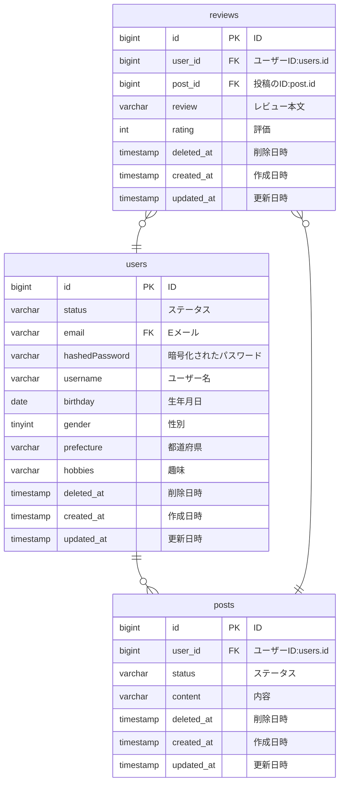

# ER図

## プロフィール評価アプリデータベース

```mermaid
erDiagram
    users ||--o{ posts : ""
    reviews }o--||users : ""
    reviews }o--||posts : ""

    users {
        bigint id PK "ID"
        varchar status "ステータス"
        varchar email FK "Eメール"
        varchar hashedPassword "暗号化されたパスワード"
        varchar username "ユーザー名"
        date birthday "生年月日"
        tinyint gender "性別"
        varchar prefecture "都道府県"
        varchar hobbies　"趣味"
        timestamp deleted_at "削除日時"
        timestamp created_at "作成日時"
        timestamp updated_at "更新日時"

    }

    posts {
        bigint id PK "ID"
        bigint user_id FK "ユーザーID:users.id"
        varchar status "ステータス"
        varchar content "内容"
        timestamp deleted_at "削除日時"
        timestamp created_at "作成日時"
        timestamp updated_at "更新日時"
    }

    reviews {
        bigint id PK "ID"
        bigint user_id FK "ユーザーID:users.id"
        bigint post_id FK "投稿のID:post.id"
        varchar review "レビュー本文"
        int rating "評価"
        timestamp deleted_at "削除日時"
        timestamp created_at "作成日時"
        timestamp updated_at "更新日時"
    }
```
