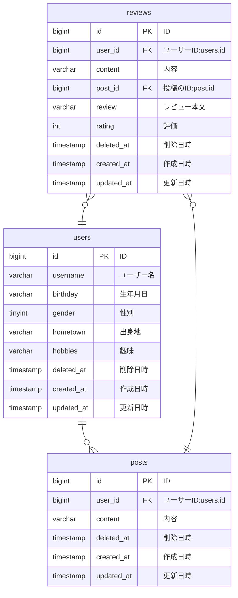

# ER図

## プロフィール評価アプリデータベース

```mermaid
erDiagram
    users ||--o{ posts : ""
    reviews }o--||users : ""
    reviews }o--||posts : ""

    users {
        bigint id PK "ID"
        varchar username "ユーザー名"
        varchar birthday "生年月日"
        tinyint gender "性別"
        varchar hometown "出身地"
        varchar hobbies　"趣味"
        timestamp deleted_at "削除日時"
        timestamp created_at "作成日時"
        timestamp updated_at "更新日時"
    }

    posts {
        bigint id PK "ID"
        bigint user_id FK "ユーザーID:users.id"
        varchar content "内容"
        timestamp deleted_at "削除日時"
        timestamp created_at "作成日時"
        timestamp updated_at "更新日時"
    }

    reviews {
        bigint id PK "ID"
        bigint user_id FK "ユーザーID:users.id"
        varchar content "内容"
        bigint post_id FK "投稿のID:post.id"
        varchar review "レビュー本文"
        int rating "評価"
        timestamp deleted_at "削除日時"
        timestamp created_at "作成日時"
        timestamp updated_at "更新日時"
    }
```
